 

  

<a href="#about">About</a> ·
<a href="#experience">Experience</a> ·
<a href="#achievements">Achievements</a> ·
<a href="#patent">Patent</a> ·
<a href="#projects">Projects</a> ·
<a href="#stack">Stack</a> ·
<a href="#analytics">Analytics</a>

## About

<table>
<tr>
<td width="60%" valign="top">

I build systems that sit at the intersection of **applied AI and backend engineering** — retrieval pipelines, multi-agent workflows, and the infrastructure that keeps them fast and reliable in production.

Currently a B.Tech Computer Science student at **BML Munjal University**, spending most of my time turning research ideas — RAG, agentic reasoning, LLM orchestration — into systems that actually ship.

I care about the layer beneath the demo: context windows that don't overflow, agents that fail gracefully, and backends that hold up under real traffic.

</td>
<td width="40%" valign="top">

**Currently building**
> RAG systems · LLM applications · Multi-agent AI · LangChain · Backend services

**Learning next**
> LangGraph · Distributed AI systems · Scalable backend architecture

**Based in**
> India

</td>
</tr>
</table>

## Experience

<table>
<tr>
<td width="8%" align="center" valign="top">

**◆**
 2026

</td>
<td width="92%">

**Full Stack Development Intern**
&nbsp;·&nbsp; Bharat Electronics Limited

> Contributed to full-stack systems in a defence-technology engineering environment — working across the application layer while adapting to production standards used in mission-critical software.

</td>
</tr>
<tr>
<td align="center" valign="top">

**◆**
 2025

</td>
<td>

**Creative Media Intern**
&nbsp;·&nbsp; Picturizze

> Worked at the intersection of design and technology, producing media content and creative assets while sharpening an eye for visual storytelling — a perspective that now shapes how I design products, not just build them.

</td>
</tr>
</table>

## Achievements

<table>
<tr>
<td width="50%" valign="top">

> **🏆 Published Indian Patent**
> Lead Inventor on a nationally filed and published patent — see the full showcase below.

</td>
<td width="50%" valign="top">

> **🧠 Smart India Hackathon**
> Cleared the internal round, building a solution against a real national-scale problem statement under tight time constraints.

</td>
</tr>
<tr>
<td valign="top">

> **🤖 Robothon 2025**
> Competed in a robotics and automation challenge, applying embedded and systems thinking outside pure software.

</td>
<td valign="top">

> **🎓 Merit Scholarship**
> Awarded on academic merit at BML Munjal University.

</td>
</tr>
</table>

## Patent Showcase

<table>
<tr>
<td width="34%" align="center" valign="top">

</td>
<td width="66%" valign="top">

### A Wearable Safety System — Anti-Theft, Emergency SOS & Fall Detection

**Role:** Lead Inventor &nbsp;|&nbsp; **Status:** Published &nbsp;|&nbsp; **Application No.:** `202641049800` &nbsp;|&nbsp; **Publication Date:** 1 May 2026

A smart eyewear system designed for personal safety and elderly care, combining:

&nbsp;&nbsp;**◆** BLE-based proximity anti-theft detection
&nbsp;&nbsp;**◆** Gesture-activated emergency SOS with automatic audio and snapshot capture
&nbsp;&nbsp;**◆** IMU-based automatic fall detection
&nbsp;&nbsp;**◆** A dual mobile-application ecosystem connecting the wearer and their caregiver in real time

 

  

</td>
</tr>
</table>

## Projects

<table>
<tr>
<td width="50%" valign="top">

### CourseMate AI
**AI-powered notes platform built on RAG**

Turns raw lecture material and documents into a queryable knowledge base — students ask questions in natural language and get grounded, citation-backed answers instead of skimming pages of notes.

`Python` `LangChain` `Vector DB` `RAG`

</td>
<td width="50%" valign="top">

### CodeGuardian AI
**Multi-agent AI code review platform**

A team of specialized agents — each responsible for a distinct concern like security, style, and logic — collaborate to review a pull request the way a senior engineering team would.

`Python` `Multi-Agent Systems` `LLMs` `FastAPI`

</td>
</tr>
<tr>
<td width="50%" valign="top">

### CineSage Analytics
**LLM-powered movie intelligence system**

Combines structured film data with an LLM reasoning layer to surface insights, comparisons, and recommendations that go beyond simple filtering — analysis, not just search.

`Python` `LLMs` `Data Analytics` `APIs`

</td>
<td width="50%" valign="top">

 

> More systems in progress — this profile grows as they ship.

</td>
</tr>
</table>

## Tech Stack

<table>
<tr>
<td valign="top" width="16%"><b>AI</b></td>
<td valign="top">

</td>
</tr>
<tr>
<td valign="top"><b>Backend</b></td>
<td valign="top">

</td>
</tr>
<tr>
<td valign="top"><b>Frontend</b></td>
<td valign="top">

</td>
</tr>
<tr>
<td valign="top"><b>Databases</b></td>
<td valign="top">

</td>
</tr>
<tr>
<td valign="top"><b>Cloud</b></td>
<td valign="top">

</td>
</tr>
<tr>
<td valign="top"><b>Dev Tools</b></td>
<td valign="top">

</td>
</tr>
</table>

## Analytics

a growing footprint — early days, building in public

  

<b>📊 View GitHub Analytics</b>

 

 

Designed and built from scratch · <a href="#about">Back to top ↑</a>

